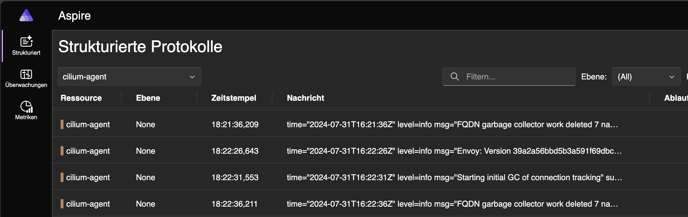
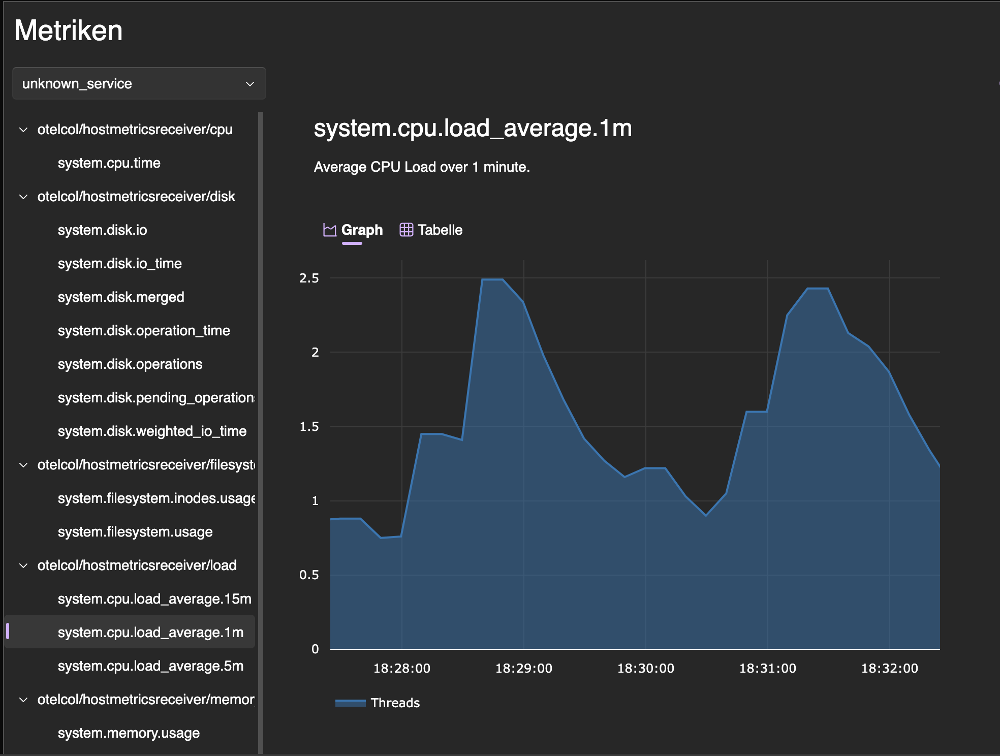

# Dotnet Aspire Dashboard and OpenTelemetry Collector in Kubernetes
One of the most used oberservability stacks in Kubernetes must be the Kube-Prometheus-Stack.
Bringing Prometheus, Grafana, Alertmanager to the table, Promtail and Loki completing the stack on the logging side.

One problem I always had with this is its resource consumption. It might not be as huge as one might expect it to be, but still if you are running a really low power homelab on k3s this might be important to you.

**Are there any alternatives that consume way less resources? Even if they might not be as all powerful as Grafana?**

Yes there is!

The [Dotnet Aspire Dashboard][1] has originally been developed to be a leightweight tool to aid local development.
And bring the local development environment closer to the desired cloud setups.

So my goal was combining the [Dotnet Aspire Dashboard][1] with the [OpenTelemetry Collector][2] to see how much functionality this might be able to provide.

So I set out on creating [this Helm Chart][3], here is whats currently possible using this.

### Log collection by application

The [OpenTelemetry Collector][2] is able to collect the logs for all Pods running in your cluster and forwarding them to the [Dotnet Aspire Dashboard][1].

### Host metrics

The [OpenTelemetry Collector][2] is able to scrape host metrics and send them to the [Dotnet Aspire Dashboard][1].
At the moment Pod metrics do not yet work,
except you configure your application to send
send your metrics to the Dashboard using [OpenTelemetry][4].

### For the future

###### Pod metrics
Would it be possible to also scrape Pod metrics without the need to change the pod configuration?

[1]: https://learn.microsoft.com/en-us/dotnet/aspire/fundamentals/dashboard/overview?tabs=bash
[2]: https://github.com/open-telemetry/opentelemetry-collector
[3]: https://github.com/kube-the-home/aspire-dashboard-helm
[4]: https://opentelemetry.io/
